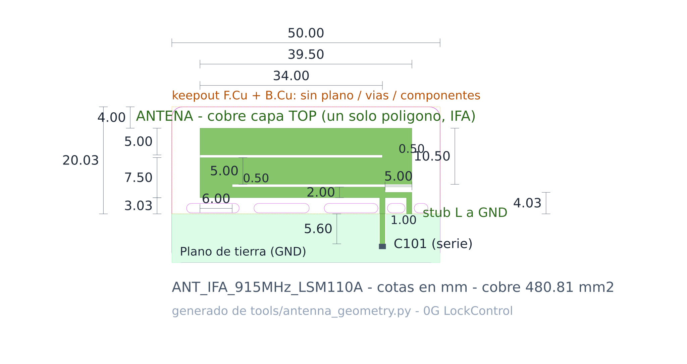

# Antena PCB en KiCad — `ANT_IFA_915MHz_LSM110A`

Diseño en KiCad de la antena IFA ranurada del plano **«1.5 Antenna Dimension»**, para el
0G LockControl (LSM110A, Sigfox RC2/RC4, **902 – 928 MHz**).

> Reconstruida y **verificada píxel a píxel contra el plano oficial** del
> `SJIT_LSM110A_UserManual_Rev1.4`. Esa banda no es una elección: el S11 medido por SJI da
> ≤ −16 dB en 902 – 928 MHz y solo −8.7 dB a 868 MHz, así que **para EU868 hay que
> reajustar**.



Todo se genera desde un único fichero de geometría paramétrica y se verifica con el motor
real de KiCad: **134 comprobaciones, 0 fallos, DRC limpio**.

---

## ⚠️ Aviso de certificación — leer antes de usarlo en producción

Este footprint es un **redibujo**. La certificación modular FCC del LSM110A
(FCC ID `2AS8LLSM110A`) cubre **únicamente el patrón «EVB_LSM ANT» de SJI**.

Dónde estamos, con precisión:

- ✅ **La geometría coincide con el plano oficial de SJI** (User Manual Rev 1.4 § 1.5),
  verificada píxel a píxel sobre el bitmap original: los seis niveles verticales, las dos
  aperturas de ranura, los extremos horizontales y el gap del CPWG. No queda ninguna cota
  en duda.
- ✅ **La red de matching coincide con el esquemático oficial** (§ 1.3): `L101` 0 Ω serie,
  `C101` 2.2 pF shunt lado antena, `C102` DNI shunt lado radio.
- ⚠️ **Lo que el plano no resuelve** es el detalle por debajo de ~0.12 mm: radios de
  esquina y compensaciones de grabado. Para eso sigue haciendo falta el **Gerber**, que es
  confidencial (pedirlo a GREATECH o SJI bajo NDA — ver
  [`certificacion-FCC/README.md`](../certificacion-FCC/README.md)).
- ⚠️ **Para apoyarse en la certificación modular**, la decisión no es de ingeniería sino
  del expediente: hay que confirmar con el certificador si «igual al plano cotado del
  fabricante» basta, o si exige el Gerber. `docs/especificaciones-diseno-pcb.md` pide lo
  segundo: *«Antena importada del Gerber oficial SJI (NO redibujada a mano)»*.
- ✅ **Hay criterio de aceptación eléctrico:** el S11 medido de SJI (§ 1.6) está en
  [`docs/verificacion.md`](docs/verificacion.md#criterio-de-aceptación-de-la-medida). Si la
  placa fabricada reproduce esa curva, el redibujo queda validado también eléctricamente.

---

## Contenido

**Las bibliotecas KiCad NO viven aquí.** Están donde vive el LSM110A, para que KiCad
necesite un solo path registrado y todo salga bajo un único nickname:

```
../v0-replica-sji/kicad-lib/                nickname de footprints: 0G-LockControl
  LSM110A.kicad_mod                         módulo LGA-34            (generado en F1)
  LSM110A.kicad_sym                         símbolo, 34 pines        (generado en F1)
  ANT_IFA_915MHz_LSM110A.kicad_mod          la antena: cobre + keepout + documentación
  ANT_LSM110A_BreakAwaySlots_EVM_ONLY.kicad_mod  troquelado del EVM - NO en el producto
  C_0402_1005Metric_0G.kicad_mod            land 0402 para L101 / C101 / C102
  TP_Coax_50R_NanoVNA.kicad_mod             isla de 3 pads para pigtail coaxial
  0G_Antenna.kicad_sym                      símbolo de la antena (2 pines: FEED, GND)
```

Los seis últimos los regenera `tools/build.sh`; los dos del LSM110A no se tocan.
Detalle de instalación y pinout en [`../v0-replica-sji/kicad-lib/README.md`](../v0-replica-sji/kicad-lib/README.md).

Lo que sí vive en esta carpeta:

```
antenna-test-board/                         placa de prueba y ajuste, 50 × 80 mm, DRC = 0
  antenna-test-board.kicad_pcb
  antenna-test-board.kicad_pro              netclases Default (0.15) y RF (1.00 / 0.15)
  antenna-test-board.kicad_dru              reglas DRC de RF
  fp-lib-table                              resuelve las bibliotecas al abrir el proyecto

tools/                                      generadores y verificadores (fuente de verdad)
docs/                                       geometría cotada y método de verificación
export/                                     renders + informe DRC (artefactos generados)
```

## Uso

### Añadir las bibliotecas a KiCad

*Preferences → Manage Footprint Libraries* y *Manage Symbol Libraries*. **Dos entradas
bastan para todo el proyecto** (LSM110A incluido):

| Tipo | Nickname | Ruta |
|---|---|---|
| Footprints | `0G-LockControl` | `${KIPRJMOD}/../Hardware/v0-replica-sji/kicad-lib` |
| Símbolos | `0G-LockControl` | `…/kicad-lib/LSM110A.kicad_sym` |
| Símbolos | `0G-Antenna` | `…/kicad-lib/0G_Antenna.kicad_sym` |

El nickname de footprints **tiene que ser `0G-LockControl`**: es el que llevan grabado los
campos `Footprint` de los dos símbolos. Si usas otro, los enlaces hay que rehacerlos a mano.

Los símbolos son dos archivos y por tanto dos nicknames — no se pueden unificar, y es mejor
así: `LSM110A.kicad_sym` está en formato KiCad 9 y `0G_Antenna.kicad_sym` en formato KiCad 7
(que KiCad 7/8/9 leen todos). **Probado con KiCad 7.0.11:** con KiCad 7 u 8 tendrás el módulo
en el PCB pero no en el esquemático — su footprint sí carga (formato 8, tolerante) y su
símbolo no (`Unable to load library`). Con KiCad 9 carga todo. Tabla completa en el
[README de `kicad-lib`](../v0-replica-sji/kicad-lib/README.md#nota-de-versión-de-kicad).

La `fp-lib-table` de `antenna-test-board/` ya trae la entrada de footprints resuelta con ruta
relativa, así que la placa de prueba se abre sin configurar nada.

### Colocar la antena en una placa

El origen del footprint es la **esquina superior izquierda del cobre**. Para reproducir el
plano en una placa cuyo borde superior esté en `y_borde`:

```
x = (ancho_placa − 39.50) / 2      ← antena centrada
y = y_borde + 4.00
```

En la placa de prueba (50 mm de ancho, borde superior en y = 0) eso da **(5.25, 4.00)**.

El footprint trae su propio *rule area* y su courtyard, así que el plano de tierra se
recorta solo y ningún componente puede caer en la zona de la antena. No hay que dibujar
el hueco a mano.

### En el esquemático

El símbolo tiene **dos pines**, y eso es deliberado:

```
                        L101 (serie)
   RFOUT (pin 33) ─────[ 0R ]───────┬──── FEED (pin 1)  ANT1
                    │               │                    GND (pin 2) ── GND
                  C102            C101                        │
                  (DNI)         (2.2 pF)                      │
                    │               │                         │
                   GND             GND ───────────────────────┘
```

Los valores son la población de referencia del User Manual FCC. Las tres posiciones
existen en la placa de prueba para poder realizar cualquier topología al ajustar.

Una IFA está unida a masa por su stub de cortocircuito, así que ese camino existe de
verdad y el esquemático debe reflejarlo. El footprint declara los pads 1 y 2 como
**net tie** (`net_tie_pad_groups`), de modo que KiCad entiende que el corto es intencional
y el DRC no lo marca.

### Regenerar y verificar

```bash
cd Hardware/KiCad/tools
./build.sh
```

Requiere KiCad ≥ 7 con los bindings de Python. Devuelve código ≠ 0 si algo falla.

**No editar a mano** los `.kicad_mod`, el `.kicad_sym` ni el `.kicad_pcb`: se generan.
Para cambiar una cota, se cambia en `tools/antenna_geometry.py` y se regenera.

## Reglas que hay que respetar al integrarla

Si no se cumplen, la antena no resuena donde se midió:

1. Borde superior de la PCB a **4.00 mm** sobre el origen del footprint.
2. Plano de tierra arrancando **exactamente** en `y = 16.03`, en ambas capas. En una IFA
   el borde del plano es parte de la antena.
3. **Cero** cobre, plano, vías o componentes por encima de ese borde, en las dos capas.
4. Costura de vías justo por debajo del borde del plano.
5. Línea RF en **CPWG 1.00 / 0.15** desde el pad de feed (User Manual FCC 5937666).
6. El plano de tierra del producto debe parecerse al de la placa de prueba. Si cambia de
   tamaño, hay que volver a ajustar.
7. En el producto final: **20 cm** mínimo antena-personas y etiquetado
   `Contains FCC ID: 2AS8LLSM110A` / `Contains IC: 25119-LSM110A` (KDB 996369 D03).

## Placa de prueba y ajuste

`antenna-test-board/` es una placa de 2 capas y **50 × 80 mm** — la PCB de referencia de
SJI que consta en el User Manual del expediente FCC. El tamaño no es arbitrario: en una
IFA el plano de tierra es el contrapeso, así que medir sobre el mismo plano de la
referencia es la única forma de que el S11 sea comparable.

Lleva la antena colocada según el plano, plano de tierra en las dos capas, línea CPWG
50 Ω, la **red de matching en π** de la referencia SJI (`L101` serie + `C101`/`C102`
shunt, tal como la da el esquemático oficial § 1.3) y una isla de 3 pads (**J1**) para soldar
un pigtail coaxial y medir con NanoVNA — J1 cumple la función del `CON101` del EVM.

El procedimiento de ajuste está en
[`docs/verificacion.md`](docs/verificacion.md#procedimiento-de-ajuste-con-nanovna).

## Documentación

- [`docs/geometria-antena.md`](docs/geometria-antena.md) — todas las cotas, cómo se
  derivan del plano, la **verificación píxel a píxel contra el plano oficial**, el
  **S11 medido** de la § 1.6, y las tres discrepancias del plano: las tres resueltas
  contra el manual (el rótulo de 4.05, la nota que ponía C101 en serie, y las ranuras
  que resultaron ser una línea de troquelado).
- [`docs/verificacion.md`](docs/verificacion.md) — qué se comprueba y cómo, los
  **9 errores** que encontró el proceso, y qué **no** cubre.

## Estado

| | |
|---|---|
| Cadena de cotas | ✅ 17/17 |
| Footprints (cargados con `pcbnew`) | ✅ 63/63 |
| Placa: DRC + cotas del cobre real | ✅ 42/42 |
| Cotejo píxel a píxel contra el plano oficial (§1.5) | ✅ todos los rasgos medibles |
| Red de matching contra el esquemático oficial (§1.3) | ✅ L101 / C101 / C102 confirmados |
| DRC de la placa de prueba | ✅ 0 violaciones, 0 pads sin conectar, 0 errores de footprint |
| Gerber oficial de SJI (detalle < 0.12 mm) | ⏳ pendiente de NDA con GREATECH |
| S11 de referencia como criterio de aceptación | ✅ §1.6 del User Manual |
| Medida de S11 | ⏳ pendiente de fabricar la placa de prueba |

Generado y verificado con KiCad 7.0.11. Formato de fichero compatible con KiCad 7/8/9.
