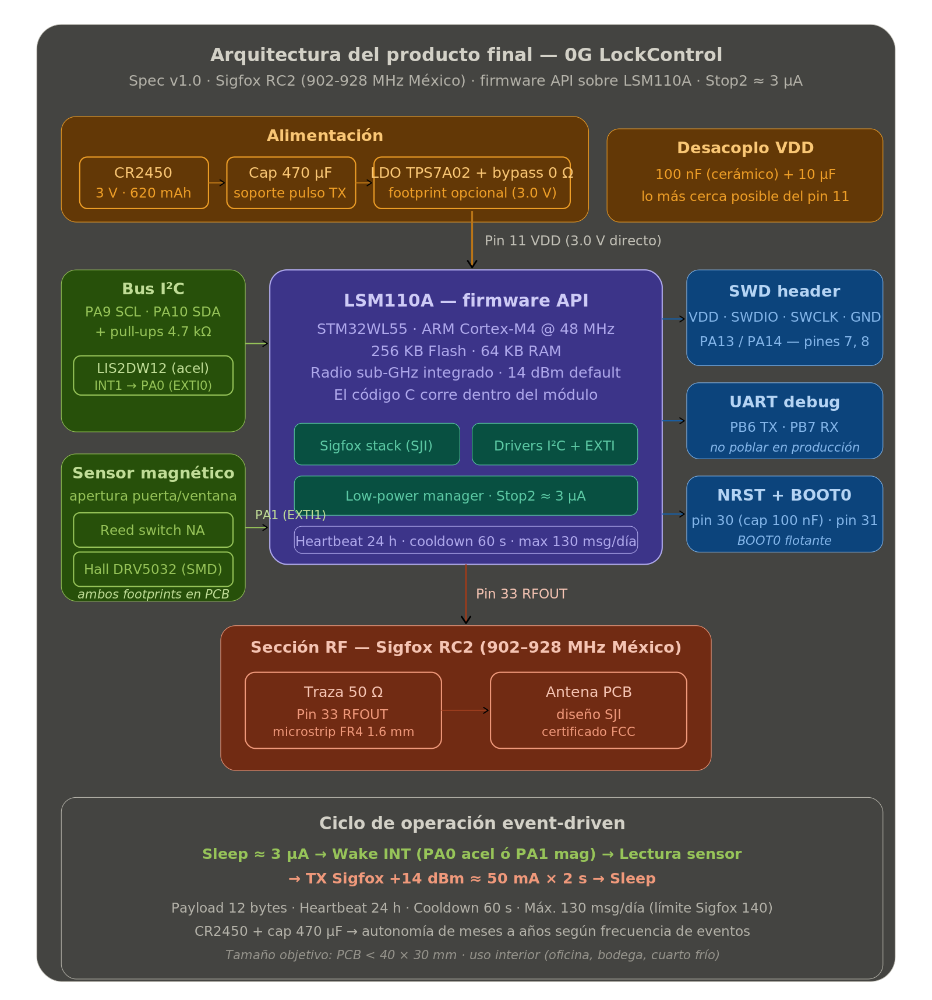

# 0G LockControl — Alarma IoT dual (acelerómetro + magnético)

> Alarma inalámbrica compacta con detección de movimiento y apertura de puerta/ventana, comunicación Sigfox RC2 sobre el SoC LSM110A.

## Descripción

**0G LockControl** es un dispositivo electrónico autónomo que combina **dos modos de detección de eventos** y los transmite por la red **Sigfox (0G)**:

- **Movimiento / vibración** vía acelerómetro **LIS2DW12** (I²C).
- **Apertura de puerta o ventana** vía sensor magnético — **reed switch NA** o **hall DRV5032** (ambos footprints en la PCB).

El dispositivo es **event-driven**: duerme en modo Stop2 (~3 µA total) y solo despierta por interrupción de hardware. El firmware se ejecuta directamente sobre el **STM32WL** integrado en el LSM110A (firmware API, sin MCU externo).

### Características

- Comunicación **Sigfox RC2** (902-928 MHz, México) — sin WiFi ni red celular.
- Tamaño objetivo **< 5 cm** — instalación adhesiva en interior (oficina, bodega, cuarto frío).
- Batería desechable **CR2450 (3 V, 620 mAh)** + capacitor de soporte 470 µF para pulsos de TX.
- Vida útil estimada de meses a años según frecuencia de eventos.
- Costo reducido de operación y manufactura.

## Arquitectura del sistema

### Ciclo de operación

```
Sleep (3µA)  →  Wake por INT (accel o magnético)  →  Leer sensor
        →  Armar payload 12 bytes  →  TX Sigfox (~50 mA × 2 s)  →  Sleep
```

### Bloques del sistema



> Diagrama disponible también en formato vectorial: [arquitectura-producto-v1.svg](./docs/Images/arquitectura-producto-v1.svg)

### Flujo de operación

1. **Detección.** El acelerómetro o el sensor magnético genera una interrupción de hardware.
2. **Despierta.** El LSM110A sale del modo Stop2 vía EXTI.
3. **Lectura.** Se leen sensores (accel via I²C, estado del magnético).
4. **Transmisión.** Se arma el payload de 12 bytes y se envía un mensaje Sigfox.
5. **Entrega.** El backend de Sigfox ejecuta un callback HTTP hacia el servidor de la app.
6. **Notificación.** La app móvil muestra la alerta con timestamp e ID del dispositivo.

## Componentes principales

| Componente | Parte | Función |
|---|---|---|
| SoC + radio | **LSM110A** (STM32WL55) | MCU Cortex-M4 + radio Sigfox integrado |
| Acelerómetro | **LIS2DW12** (I²C) | Detección de movimiento, INT1 → PA0 |
| Sensor magnético A | **Reed switch NA** | Detección de apertura (opción A) |
| Sensor magnético B | **DRV5032** (hall) | Detección de apertura (opción B) |
| Batería | **CR2450** (3 V, 620 mAh) | Alimentación desechable |
| Cap. soporte | 470 µF electrolítico | Soporte para el pulso de TX Sigfox |
| LDO (opcional) | **TPS7A02** + bypass 0 Ω | Regulación opcional |
| Antena | Traza PCB 50 Ω | Diseño SJI (certificado FCC) |

## Plataforma de desarrollo

| Herramienta | Uso |
|---|---|
| **STM32CubeIDE** | Desarrollo de firmware (C, bare-metal) |
| **STM32CubeMX** | Configuración de periféricos y clocks |
| **KiCad** | Diseño esquemático y PCB |
| **ST-Link + SWD** | Programación y debug |
| **Sigfox Backend** | Dashboard y callbacks |

## Plan de milestones

| Milestone | Entregable | Semana |
|---|---|---|
| **M0** | Repo + spec + CubeIDE setup | 1-2 |
| **M1** | Esquemático KiCad | 2-5 |
| **M2** | FW en Nucleo (accel + reed + Sigfox) | 2-5 |
| **M3** | PCB layout + gerbers | 5-7 |
| **M4** | Low power validado en Nucleo | 7-8 |
| **M5** | PCB fabricada y ensamblada | 8-11 |
| **M6** | Integración FW en PCB custom | 11-12 |
| **M7** | Prueba de campo | 12 |

## Estructura del repositorio

```
0G-LockControl-LSM110A/
├── Hardware/
│   ├── kicad/             # Proyecto KiCad (esquemático + PCB)
│   ├── Datasheets/        # Hojas de datos de componentes clave
│   ├── Schematic/
│   ├── PCB/
│   └── BOM/
├── Firmware/
│   ├── sdk/               # Fork del SDK de SJI (LSM110A)
│   ├── app/               # Código de aplicación
│   ├── drivers/           # Drivers de sensores I2C
│   ├── src/
│   ├── libs/
│   ├── config/
│   └── tools/
├── 3D-Models/
│   ├── Enclosure/
│   └── Assembly/
├── Tests/
│   ├── Lab/
│   └── Field/
├── App/
│   ├── Mobile/
│   └── Backend/
├── docs/
│   ├── spec-producto.md       # Especificación completa v1.0
│   ├── decisiones-tecnicas.md # Decisiones arquitectónicas (ADRs)
│   ├── pinout-lsm110a.md      # Asignación de pines
│   ├── Architecture/
│   ├── Images/
│   ├── References/
│   └── Guides/
├── .gitignore
└── README.md
```

## Antecedentes del desarrollo

Este proyecto es la evolución del trabajo realizado con la placa **NUCLEO-WL55JC2**, donde se validaron los siguientes hitos:

- Conexión exitosa a la red Sigfox (registro en backend, envío de mensajes).
- Conexión exitosa a LORIOT vía LoRaWAN (validación de stack).
- Implementación de detección de flanco con reed switch.
- Envío de payload Sigfox al detectar apertura.
- Caracterización del microcontrolador y periféricos del STM32WL55.

La transición al **LSM110A** permite pasar de una placa de desarrollo a un SoC integrado, habilitando el diseño de una PCB compacta y de bajo costo para producción. El firmware se programa directamente sobre el STM32WL del módulo (firmware API), sin necesidad de MCU externo ni de comandos AT.

## Protocolos de comunicación

### Sigfox (protocolo principal)

- **Zona:** RCZ2 (México / América Latina).
- **Frecuencia:** 902-928 MHz uplink.
- **Mensajes:** hasta 140 mensajes/día uplink, 4 downlink/día.
- **Payload:** máximo 12 bytes por mensaje.
- **Alcance:** hasta 50 km en zona rural, 3-10 km en zona urbana.
- **Potencia TX:** configurable, default +14 dBm (~50 mA).

### Comunicación local (futuro)

- BLE (Bluetooth Low Energy) para activación y configuración desde la app móvil.

## Documentación adicional

- 📕 **[Especificación de producto v1.0 (PDF)](./docs/References/spec-producto-lsm110a-v1.pdf)** — versión entregable, lista para compartir
- 📄 [Especificación de producto v1.0 (Markdown)](./docs/spec-producto.md)
- 📄 [Decisiones técnicas (ADRs)](./docs/decisiones-tecnicas.md)
- 📄 [Asignación de pines del LSM110A](./docs/pinout-lsm110a.md)

## Empresa

**0G IoT Net Solutions** — [iotnet.mx](https://iotnet.mx)

## Desarrollador

**José Francisco Díaz Figueroa** — Hardware Developer
jdiaz@iotnet.mx

## Referencias

- [Documentación STM32WL Series](https://www.st.com/en/microcontrollers-microprocessors/stm32wl-series.html)
- [Repositorio LSM110A (Support-SJI)](https://github.com/Support-SJI/LSM110A)
- [Sigfox Build — Development](https://build.sigfox.com/development)
- [Sigfox Build — Industrialization](https://build.sigfox.com/industrialization#the-sigfox-credentials)
- [STM32CubeWL GitHub](https://github.com/STMicroelectronics/STM32CubeWL)
- [RF Board Layout Guide (AN5457)](https://www.st.com/resource/en/application_note/dm00660594.pdf)

## Licencia

Por definir.
