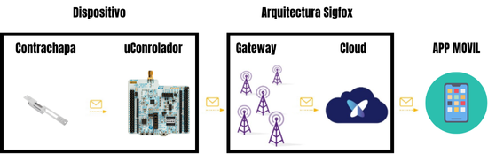

# Arquitectura del Sistema - 0G LockControl

## 1. Visión General

El sistema 0G LockControl es un dispositivo IoT de monitoreo de apertura de puertas que utiliza la red Sigfox para transmitir alertas en tiempo real. El diseño se basa en el SoC **LSM110A** (STM32WL core) como unidad central de procesamiento y comunicación.

## 2. Diagrama de Bloques



*Nota: El diagrama original fue creado durante la fase de pruebas con el NUCLEO-WL55JC2. La arquitectura final sustituye la placa NUCLEO por el SoC LSM110A en una PCB dedicada.*

```
DISPOSITIVO                          RED SIGFOX                    USUARIO
┌────────────────────────┐     ┌──────────────────┐     ┌─────────────────┐
│                        │     │                  │     │                 │
│  [Reed Switch] ──EXTI──┤     │   Base Stations  │     │  Backend API    │
│                        │     │   (Gateways)     │     │  (Callback)     │
│  [LSM110A SoC]         │────▶│                  │────▶│       │         │
│   - Cortex-M4          │ RF  │   868/902 MHz    │ IP  │       ▼         │
│   - Radio Sub-GHz      │     │                  │     │  App Móvil      │
│   - Sigfox Stack       │     │                  │     │  (Push Notif.)  │
│                        │     │                  │     │                 │
│  [Batería] ──LDO──VCC  │     │                  │     │                 │
│                        │     │                  │     │                 │
└────────────────────────┘     └──────────────────┘     └─────────────────┘
```

## 3. Subsistemas

### 3.1 Subsistema de Sensado Magnético

- **Sensor**: Reed switch (normalmente cerrado)
- **Principio**: Interrupción de campo magnético al abrir la puerta
- **Montaje**: Dispositivo en marco fijo, imán en hoja móvil
- **Señal**: Binaria (abierto/cerrado) conectada a GPIO con EXTI
- **Acondicionamiento**: Resistor pull-up + filtro RC anti-rebote

**Alternativa evaluada**: Sensor Hall digital (requiere alimentación constante, descartado por consumo)

### 3.2 Unidad de Procesamiento (LSM110A)

| Característica | Detalle |
|---|---|
| Módulo | LSM110A (SJI) |
| Core | STM32WL (ARM Cortex-M4) |
| Radio | Sub-GHz integrado |
| Protocolo | Sigfox (RCZ2 para México) |
| Frecuencia | 902 MHz (uplink) |
| Modos de bajo consumo | STOP, Sleep, Standby |
| Programación | SWD (ST-LINK externo) o UART |
| Repositorio | [Support-SJI/LSM110A](https://github.com/Support-SJI/LSM110A) |

### 3.3 Alimentación

- Batería (tipo por evaluar: CR2032, LiPo, o AA)
- Regulador LDO de bajo dropout
- Objetivo: meses a años de autonomía en modo sleep con transmisiones esporádicas

### 3.4 Antena

- Frecuencia: 868/902 MHz (Sigfox RCZ2)
- Opciones: PCB trace antenna o chip antenna
- Diseño según AN5457 de ST (Optimized RF Board Layout for STM32WL)

### 3.5 Comunicación Sigfox

- **Uplink**: Máx. 140 mensajes/día, payload 12 bytes
- **Downlink**: Máx. 4 mensajes/día, payload 8 bytes
- **Callbacks**: HTTP/HTTPS configurados en backend.sigfox.com
- **Credenciales**: ID + PAC + KEY provistos por Sigfox Build

## 4. Evolución desde NUCLEO-WL55JC2

### Hitos completados con NUCLEO

1. Conexión a red Sigfox (backend.sigfox.com, device ID: 54396924)
2. Conexión a LORIOT vía LoRaWAN (device 0080E1)
3. Código de detección de flanco en PB1 con reed switch
4. Envío de payload Sigfox al detectar apertura
5. Certificados y credenciales Sigfox cargados
6. Caracterización de periféricos (GPIO, UART, LEDs, botones)
7. Pruebas de comandos AT para Sigfox

### Transición a LSM110A

- El NUCLEO incluye programador ST-LINK integrado (caro para producción)
- El LSM110A permite PCB dedicada con solo los componentes necesarios
- Se mantiene compatibilidad de código (mismo core STM32WL)
- Programación externa vía ST-LINK o UART reduce costo

## 5. Decisiones de Diseño

| Decisión | Opción Elegida | Alternativa | Justificación |
|---|---|---|---|
| SoC | LSM110A | STM32WL55CCU7 standalone | Módulo integrado, más fácil de diseñar PCB |
| Protocolo LPWAN | Solo Sigfox | Sigfox + LoRa dual | Simplicidad, menor costo, suficiente para el caso de uso |
| Sensor | Reed switch | Sensor Hall | Consumo nulo en reposo, bajo costo |
| Programación | ST-LINK externo / UART | ST-LINK integrado | Reduce costo del BOM |
| PCB | Una sola capa | Dos capas | Reducción de costos de manufactura |
| App framework | Flutter / React Native | Nativo (Kotlin/Swift) | Multiplataforma, desarrollo más rápido |

## 6. Recursos y Enlaces

- [Documentación STM32WL](https://www.st.com/en/microcontrollers-microprocessors/stm32wl-series/documentation.html)
- [Repositorio LSM110A (SJI)](https://github.com/Support-SJI/LSM110A)
- [STM32CubeWL GitHub](https://github.com/STMicroelectronics/STM32CubeWL)
- [Sigfox Build Development](https://build.sigfox.com/development)
- [Sigfox Industrialization](https://build.sigfox.com/industrialization#the-sigfox-credentials)
- [Octopart - STM32WL55JCI7U](https://octopart.com/es/part/stmicroelectronics/STM32WL55JCI7U)
- [Notion - Documentación NUCLEO](https://star-muskmelon-e73.notion.site/NUCELO-STM32WL55JC2-20f00f12d64280879a8fe57968791522)
- [Video: LoRaWAN + Sigfox Coexistence](https://www.youtube.com/watch?v=HsrL-7WmhUE)
- [TrueStepByStep - LoRa](https://www.youtube.com/watch?v=xwhwI3P_Xro)
